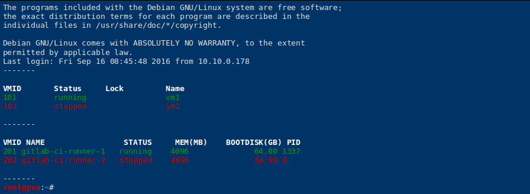
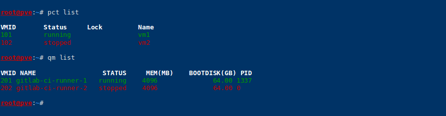

# PVE CLI dashboard

If you've got a lot of VMs, you might want to see their status quickly when on any PVE host. This snippet just prettifies the output by adding some colors.





## Installation

```
wget https://raw.githubusercontent.com/morph027/pve-cli-dashboard/master//.bash_aliases -O /etc/pve/.bash_aliases

cat >> ~/.bash_aliases << EOF
. /etc/pve/.bash_aliases
EOF
```
